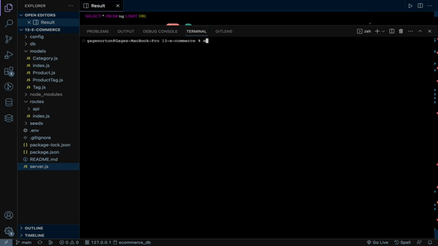

# E-commerce Backend Api
This API provides the functionality to interact with a database for a retail store, enabling users to perform GET, POST, PUT, and DELETE operations on products. 
# Usage 
Before using this application, you must install the necessary dependencies, including Node.js, Express, mysql2, and Sequelize. To do so, run the following command in your terminal:

``npm install``

Next, sign into the MySQL shell using the following command:

``mysql -u root -p <your password>``

Create the database by using 

``SOURCE ./schema.sql``.

After creating the database, exit the MySQL shell and add seeds by running the following command:

``npm run seed``

Finally, start the server and sync the Sequelize models to the MySQL database by running the following command:

``npm start`` 

# Links 
- [Walkthrough video](https://drive.google.com/file/d/136gO9OSAHJkd6hkpCv62Jp4mgIyjh-Q2/view)
- [MIT](https://opensource.org/license/mit/)

# Questions 
If you have any questions or issues, please feel free to reach out to me via email at nortongage0@gmail.com or on [Github](https://github.com/Gatewayss).